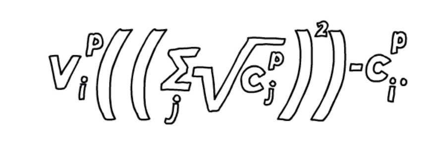

# quadratic-funding

### quadratic funding means the matching value of a poject is the square of the sum of the underrot of the donations or (number of funders for a specific project)/total funders * matching value which is decided by the protocol owner

## I hope i did everything correctly thank u :)
